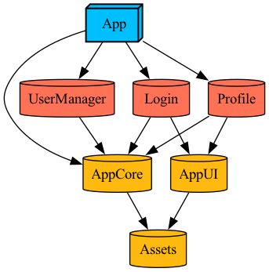

# Project architecture

Our single app projects use the same basic module architecture and consist from the following base targets. 

Basically any of the following modules can contain tests and "testing" code. For us "testing" code means any useful extensions and mock implementations that could be used for tests. To simplify usage of this testing code we have optional "Testing" folder under module's folder (that usually contains Sources and Tests folder) which is imported for debug configurations. This way we make sure this testing code never leaves dev machines.

## Core
Contains stuff that is shared basically throughout the whole project - models, extensions. Might be renamed based on your project name - _\<Project>Core_, _\<Project>\_Core_, depends on preferences of the dev team.

Most importantly it contains protocol interfaces **without any implementations**. In the [example project][example project] you can see [`UserManager`](/ProjectTemplate/Modules/Core/Sources/Protocols/UserManager.swift), that defines how user manager looks like and that's all of it. If we were really correct, we should rather have a module for that but sometimes it seems like too much effort that would significantly increase number of dynamic frameworks so this is our little compromise as basically all modules depend on Core. Of course you can do it your way 😎

## AppUI
Contains UI components that are shared throughout the app - button styles, text styles, colors, reused list cells, etc. By design this module does not depend on [Core](#core) as we prefer these view components to be just simple UI views.

It is a good idea to do some [snapshot tests](https://github.com/pointfreeco/swift-snapshot-testing) for your UI components 💡

## Assets
As mentioned in [AppUI](#appui), we prefer our views to be as simple as possible, therefore there isn't any relationship between [Core](#core) and [AppUI](#appui) modules. But still there might be some stuff you wanna share - icons, localizations. 

We have pretty good experience with having a single localization strings file (string catalog soon) and single asset catalog for the whole project - this way we can make sure that e.g. icons are not duplicated unless it is so by design. If you have a single strings file and wanna share it between [Core](#core) and [AppUI](#appui) modules, you need some module that will be linked to both and that's our Assets module. The use case for sharing icons and localizations between both modules is that you might wanna have some localized error messages in the [Core](#core) module, so it can be reused throughout the [App](#app) and you also might have a view with localized message in the [AppUI](#appui) module. This way you can do that.

## App
Contains the final app, might be named _App_ or renamed based on project name, depends on preferences of devs working on it. Always contains our dependency injection container (just a struct with some protocol conformances) with implementations of required dependency protocols.

## Feature & Service modules
Then project contains various number of feature and service modules - in our example feature modules would be [Login][login] and [Profile][profile], service module would be [UserManager][usermanager module].

In general such modules are static frameworks, service frameworks should always be static as no one except the [App](#app) should depend directly on them (you should depend on its interface protocol that is in our case part of the [Core](#core) module). This also improves compile time as to build [Profile][profile] module, I don't need to compile [UserManager][usermanager module] module and any of its dependencies, [Core](#core) is enough for it.

This is module graph of the [example project][example project] where you can see how [Login][login] and [Profile][profile] modules have no dependency to [UserManager][usermanage module], they just depend on [Core](/TemplateProject/Modules/Core) module as it contains the interface for it. This allows [UserManager][usermanager module] module to stay static.

  

Feature frameworks might be dynamic that depends on your case, but mostly you should be good with static frameworks.

[example project]: /ProjectTemplate
[usermanager module]: /ProjectTemplate/Modules/UserManager
[profile]: ProjectTemplate/Modules/Profile/
[login]: ProjectTemplate/Modules/Login