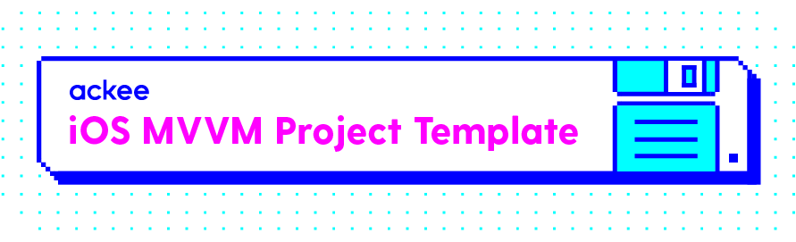

# iOS MVVM Project Template

This repository contains one of our project template components, this document will guide you through the setup and will suggest some good practices on how to use it.

Our template consists of two components, well three if you may:
- library with reused components like API service for network calls ([SPM](spm) and [Carthage][carthage] compatible)
- [Tuist plugin][tuist plugin] that we use to share components among our projects
- [example project][example project] that consumes both of the above

## Requirements
Template itself basically has no requirements, it just relies heavily on [Tuist][tuist]. AckeeTemplate library that is part of this repository is [SPM][spm] and [Carthage](carthage) compatible so you can choose your integration style according to your preferences. The [example project][example project] uses [Carthage][carthage] as it is preferred for us.

## Documentation
- [Project generation](Documentation/ProjectGeneration.md)
- [Project architecture](Documentation/ProjectArchitecture.md)

## Usage
The easiest usage would be to copy the [example project][example project] and update it according to your needs. It would be good idea to update the AckeeTemplate lib to latest version and to also update our [Tuist plugin][tuist plugin].

## Future steps
In future we would love to move the whole template to Tuist plugin which will allow us to use this template in true template manner.

In the meantime next minor step would be to create a true release process that would use GitHub releases where it would be possible to download archive with all the necessary stuff - for now we need to be good with this guide.

[example project]: ProjectTemplate
[carthage]: https://github.com/Carthage/Carthage
[spm]: http://github.com/apple/swift-package-manager
[tuist]: https://tuist.io
[tuist plugin]: https://github.com/AckeeCZ/AckeeTemplate-TuistPlugin